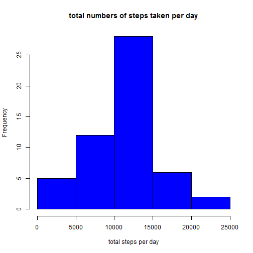
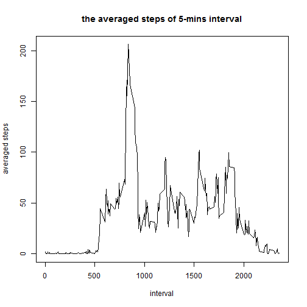
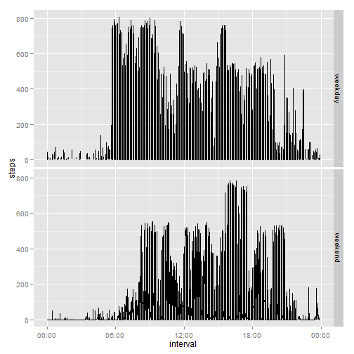

_This is a R makrdown file for the Reproducible Research first project._


**Loading data into R**

```r
library(data.table)
```

```
## data.table 1.9.4  For help type: ?data.table
## *** NB: by=.EACHI is now explicit. See README to restore previous behaviour.
```

```r
data=fread("activity.csv")
```

**what is the mean total number of steps taken per day?**

1.a histrogram of total numbers of steps taken per day


```r
## get the total steps of each days(61 days total)
library(plyr)
total=ddply(data,~date,summarise,sum=sum(steps))
hist(total$sum,col=4, main="total numbers of steps taken per day",xlab="total steps per day")
```

 

2.the mean and median of total numbers of steps per day


```r
mean(total$sum,na.rm=TRUE)
```

```
## [1] 10766.19
```

```r
median(total$sum,na.rm=TRUE)
```

```
## [1] 10765
```


**what is the average daily activity pattern?**

1. A time serious plot of 5-mins interval and the average number of steps taken, averaged across all days

```r
ave=ddply(data,~interval,summarise,mean=mean(steps,na.rm=TRUE))
plot(ave$interval,ave$mean,type="l",main="the averaged steps of 5-mins interval",xlab="interval",ylab="averaged steps")
```

 

2. which interval contains the max numbers of steps?

```r
which.max(ave$mean)
```

```
## [1] 104
```

```r
data[104,]
```

```
##    steps       date interval
## 1:    NA 2012-10-01      835
```

```r
data[835,]
```

```
##    steps       date interval
## 1:    90 2012-10-03     2130
```
the 2130 interval contains the max numbers of steps.

**Imputing missing values**

1.total number of missing values


```r
any(is.na(data$date))
```

```
## [1] FALSE
```

```r
any(is.na(data$interval))
```

```
## [1] FALSE
```

```r
any(is.na(data$steps))
```

```
## [1] TRUE
```

```r
length(which(is.na(data$steps)))
```

```
## [1] 2304
```

2. fill in the missing values in the dataset

```r
##ave[is.na(ave)] <- mean(ave$mean, na.rm = TRUE)
##now replace NA steps with the average steps taken for each day
newdata=data
isna=which(is.na(newdata$steps))
Group=(Isna-1)%/%288+1
```

```
## Error in eval(expr, envir, enclos): object 'Isna' not found
```

```r
n=length(Isna)
```

```
## Error in eval(expr, envir, enclos): object 'Isna' not found
```

```r
for (i in 1:n)
  {  newdata$steps[isna[i]]=ave[Group[i],2]}
```

```
## Error in eval(expr, envir, enclos): object 'n' not found
```

```r
## make a historgram
total2=ddply(newdata,~date,summarise,sum=sum(steps))
hist(total2$sum,col=4, main="total numbers of steps taken per day",xlab="total steps per day")
```

 

```r
##mean and median
mean(total2$sum)
```

```
## [1] NA
```

```r
median(total2$sum)
```

```
## [1] NA
```

Comparing the mean and median before and after, the mean decreases, median doesn't change. Even though the sum of steps increases, the number of data counted (the denominator) increases and has larger effect on data. For the total daily number of steps, the number increases.

**Are there differences in activity patterns between weekdays and weekends?**

```r
newdata$da=as.character(newdata$date)
newdata$da=as.POSIXct(newdata$da,format="%Y-%m-%d")
newdata$day=weekdays(newdata$da)
newdata$day[newdata$day=="Monday"]=1
newdata$day[newdata$day=="Tuesday"]=2
newdata$day[newdata$day=="Wednesday"]=3
newdata$day[newdata$day=="Thursday"]=4
newdata$day[newdata$day=="Friday"]=5
newdata$day[newdata$day=="Saturday"]=6
newdata$day[newdata$day=="Sunday"]=7
newdata$day=as.numeric(newdata$day)
```

create a new variable "week" to indicate the date is weekend or weekday

```r
newdata$week=1:17568
for (i in 1:17568){
  if (newdata$day[i]<=5)
    {newdata$week[i]=c("weekday")}
  if (newdata$day[i]>=6)
      {newdata$week[i]=c("weekend")}}
```

plot the graph

```r
#copy and paste a new dataframe "pic" to plot the graph
pic=newdata
pic$interval=as.integer(pic$interval)
#transform the interval to time format 
pic$interval<- sprintf("%04d", pic$interval)
pic$interval=format(strptime(pic$interval, format="%H%M"), format = "%H:%M")
pic$interval=as.POSIXct(pic$interval,format="%H:%M")
#plot the graph
library(ggplot2)
library(scales)
ggplot(pic, aes(interval, steps)) + geom_line() + scale_x_datetime(labels = date_format("%H:%M")) + xlab("interval") + ylab("steps") +facet_grid(week~.)
```

```
## Warning: Removed 2 rows containing missing values (geom_path).
```

 

